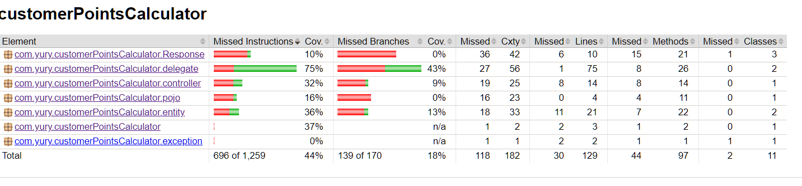
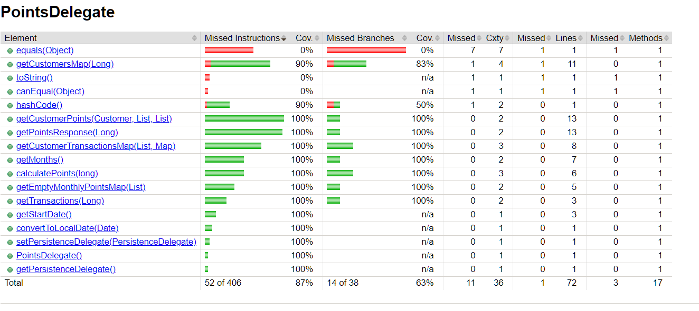

# customerPointsCalculator
 Calculate User Points from the List of Transactions

To start the application follow these steps:

1) Install maven 3, java 11
2) Open customerPointsCalculator folder and run this command in console: mvnw spring-boot:run
3) Use postman to call the GET endpoint: http://localhost:8080/points
4) Use postman to call the GET endpoint by customer id: http://localhost:8080/points/1

Here is the sample json response which will be returned:

To check the jacoco coverage report go to target\site\jacoco\
I added the current coverage information, as you can see all business logic located in PointsDelegate and 100% tested
(except for equals method which is generated by lombok and never used)

